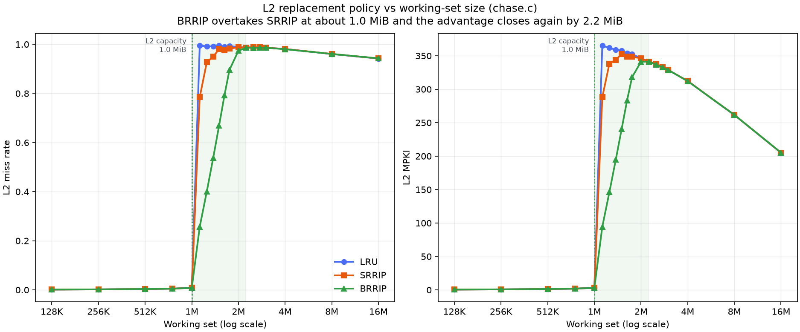
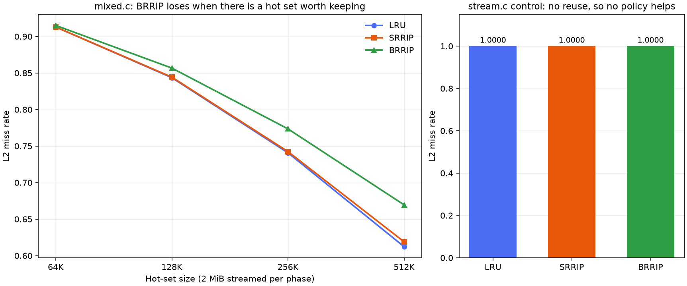

# SRRIP and BRRIP in gem5

Two cache replacement policies, SRRIP and BRRIP, implemented in gem5's C++
memory hierarchy and measured across a sweep of working-set sizes to find the
point where one overtakes the other.

## TL;DR

**What was built.** SRRIP and BRRIP as gem5 replacement policies in C++
(`SRRIPRP` and `BRRIPCustomRP`), a config harness that exposes the L2 policy
as a parameter, and three microbenchmarks. 72 sweep points, run twice, cold
and warmed, for 144 simulations total. DRRIP is **not** built; its runtime
set-dueling is deliberately out of scope.

**The headline number.** At a working set 12 percent larger than the 1 MiB
L2, BRRIP misses on 25.7 percent of L2 accesses where SRRIP misses on 78.5
percent and LRU on 99.4 percent. That is a 3.9x reduction in misses from
changing one line of insertion logic.

**The crossover.** BRRIP overtakes SRRIP right at cache capacity, around
1.0 MiB, and the advantage is gone again by about 2.2 MiB. Past roughly 3 MiB
all three policies sit within 0.0011 of each other, because at several times
capacity there is nothing left for any eviction decision to protect.

**The other side of it.** On `mixed.c`, where a small hot set genuinely is
worth keeping, BRRIP is the *worst* of the three and gets worse as the hot set
grows: 0.6695 against LRU's 0.6122 at a 512 KiB hot set. Neither static policy
wins everywhere, and the boundary sits at a workload property nothing knows
before run time. That is precisely the argument for DRRIP.

**Correctness.** Miss counts are bit-identical to gem5's own RRIP
implementation on both workloads. Separately, LRU and Random produce different
miss counts at identical instruction counts, which proves the policy parameter
actually reaches the cache rather than being silently ignored.

**Warmup.** An atomic-core warmup with a stats reset at the switch changes
absolute miss rates by more than tenfold below capacity, but moves the
SRRIP-minus-BRRIP gap by at most 0.0071 anywhere. The cold-cache deltas the
crossover rests on hold up.

**Setup.** Two-level hierarchy with the policy at L2, which is the LLC here.
1 MiB 16-way L2, `TimingSimpleCPU`, Syscall Emulation mode, single core,
statically linked binaries, and prefetchers disabled at both L1D and L2 so the
measurement reflects replacement rather than prefetching.

**Two benchmark bugs were found and fixed**, both of which produced clean,
plausible, meaningless numbers: gcc collapsing repeated read passes at `-O2`,
and a sequentially scanned hot set that made LRU and SRRIP take bit-identical
eviction decisions. Details in [`NOTES.md`](NOTES.md).



The workload is a pointer chase over a randomly permuted list, run against a
1 MiB 16-way L2 with the policy under test installed at that level. Reuse
distance equals the working set, so below capacity every lap hits and all
three policies are indistinguishable. Past capacity a line is evicted before
the chase laps back to it, and the policies separate hard.

The shape is the argument. LRU falls off a cliff the moment the working set
stops fitting, because a cyclic pattern is the worst case for recency: it
evicts precisely the line that will be needed soonest. SRRIP degrades more
gently through the transition, which is its scan resistance working, but it
converges back onto LRU by 2 MiB because scan resistance is not thrash
resistance. Only BRRIP holds a low miss rate past capacity, and only over a
narrow band. **No one of these policies is right everywhere, and which one
wins depends on a property of the workload that is not known until run time.**

## Scope

Implemented: SRRIP, BRRIP, the sweep harness, and the measurement.

**Not implemented: DRRIP.** The runtime set-dueling mechanism is deliberately
out of scope, and nothing here should be read as claiming otherwise.

The crossover measured above is precisely the argument for DRRIP. Two static
policies each win in a different regime, and the regime boundary sits near
cache capacity, which no compiler or programmer knows in advance. DRRIP
resolves this by dedicating a small number of sets to SRRIP and another small
number to BRRIP, then running a saturating counter on which of the two sampled
groups is taking fewer misses; the remaining majority of sets follow whichever
is currently ahead. The measurement here says how much such a mechanism could
win and over what range, which is the input that a dueling implementation
would need anyway.

## What the two supporting workloads add



`chase.c` shows BRRIP winning. `mixed.c` shows it losing, and that matters
more than it looks.

`mixed.c` interleaves a small hot set, re-read four times per phase, with a
2 MiB streaming scan that is never reused. BRRIP is worse than both LRU and
SRRIP here, and the gap widens as the hot set grows: at a 512 KiB hot set,
LRU misses 61.2 percent, SRRIP 61.9 percent and BRRIP 67.0 percent. The
reason is the same mechanism that makes BRRIP win on `chase.c`. Inserting
almost everything at the distant re-reference interval means a hot set being
pulled back into the cache cannot accumulate, because each newly inserted hot
line is itself the next eviction candidate. Only the small retained fraction
survives long enough to be hit and promoted.

So the two workloads bracket the problem. BRRIP's refusal to cache most of
what it sees is exactly right when nothing fits and exactly wrong when
something does.

`stream.c` is the control. A sequential scan past capacity has no reuse at any
distance a cache can exploit, so all three policies land on a 1.0000 miss rate,
identical to four decimal places. If they had not, the harness would be
suspect.

## Results

L2 miss rate on `chase.c`, 1 MiB 16-way L2, no prefetchers.

| Working set | LRU | SRRIP | BRRIP |
|---|---|---|---|
| 512 KiB | 0.0036 | 0.0036 | 0.0036 |
| 1 MiB | 0.0093 | 0.0083 | 0.0083 |
| 1.125 MiB | 0.9942 | 0.7846 | **0.2569** |
| 1.25 MiB | 0.9923 | 0.9273 | **0.4008** |
| 1.5 MiB | 0.9942 | 0.9806 | **0.6690** |
| 1.75 MiB | 0.9928 | 0.9825 | **0.8958** |
| 2 MiB | 0.9888 | 0.9880 | 0.9739 |
| 3 MiB | 0.9862 | 0.9863 | 0.9860 |
| 16 MiB | 0.9419 | 0.9424 | 0.9429 |

The full dataset, including MPKI and instruction counts for every run, is in
[`results/data.csv`](results/data.csv). It is committed so the plot can be
checked without re-running anything.

Two things worth noting in that table. SRRIP beats LRU substantially in the
transition region, which is its scan resistance doing what it is supposed to
do, but it converges back to LRU by 2 MiB because scan resistance is not
thrash resistance. And past about 3 MiB all three policies are within 0.0011 of
each other, because at four times capacity there is nothing left for any
replacement decision to protect.

## Correctness

Two checks, both of which the implementation had to pass before any of the
numbers above were generated.

**The policy parameter actually reaches the cache.** Running the same binary
under `--policy LRU` and `--policy Random` must produce different L2 miss
counts. It does: 1,581,765 against 1,550,485 at identical instruction counts.
Without this check, a silently ignored policy flag would produce a complete,
plausible, entirely meaningless dataset.

**The policies match a known-good reference.** gem5 ships its own RRIP
implementation. `configs/run.py` exposes it as `--policy SRRIP_REF` and
`--policy BRRIP_REF` purely for comparison, and my implementations produce
**bit-identical miss counts** to it on both workloads. Mine was written from
the paper rather than from that code, which is the point of the exercise, but
agreeing with it exactly is good evidence the result is real.

The comparison only holds with `hit_priority=True` on gem5's side. Its default
is `False`, which is the paper's frequency-priority variant where a hit
decrements the RRPV rather than clearing it. That is a different policy, and
comparing against it initially made a correct implementation look broken.

## Methodology, including the shortcuts

- **Two-level hierarchy.** The policy sits at L2, which is the last level
  here, so L2 is what this writeup calls the LLC. A third level is a
  meaningful amount of config work and would not change the comparison.
- **`TimingSimpleCPU`, not out-of-order.** MPKI is a property of the access
  stream and the cache. An in-order core produces the same stream and
  simulates fast enough to make a 60-plus-point sweep practical.
- **Microbenchmarks, not SPEC.** Three small C programs whose working sets are
  set from `argv`, so the sweep does not require recompiling.
- **Prefetchers off, at both L1D and L2.** gem5's standard library attaches a
  stride prefetcher to each. An L1 prefetcher issues its own requests down to
  L2, so leaving it on means part of the measured L2 access stream was
  generated by the prefetcher rather than the benchmark. This is the
  difference between measuring the replacement policy and measuring the
  prefetcher.
- **Syscall Emulation mode, single core, statically linked binaries.**
- **1 MiB 16-way L2, deliberately small**, so the working set can overrun it
  quickly and each simulation stays short.

## Cache warmup

Absolute miss rates from a cold cache include compulsory misses, that is,
misses on data that was never in the cache to begin with and that no
replacement policy can prevent. Since every policy takes the identical set of
compulsory misses, the deltas between policies stay valid even when the
absolute numbers are inflated. That is the standard argument for why a cold
run still supports a policy comparison.

Rather than rely on that argument, this repo also measures with warmup.
`--warmup-insts N` starts the simulation on an atomic core, which executes
quickly while still moving data through the cache hierarchy, switches to
`TimingSimpleCPU` after N instructions, and calls `m5.stats.reset()` at the
switch so the reported counters describe only the measured window.

The measured window then contains no compulsory misses from the cold start.
Verified: at a 4,000,000-instruction warmup, `simInsts` in the measured window
is exactly the full-run count minus the warmup, and gem5 logs the CPU switch.

The full warmed dataset is in
[`results/data_warmup.csv`](results/data_warmup.csv), plotted in
[`plots/crossover_warmup.png`](plots/crossover_warmup.png). Comparing the two:

| Working set | LRU cold | LRU warm | SRRIP cold | SRRIP warm | BRRIP cold | BRRIP warm |
|---|---|---|---|---|---|---|
| 512 KiB | 0.0036 | 0.0001 | 0.0036 | 0.0001 | 0.0036 | 0.0001 |
| 1 MiB | 0.0093 | 0.0002 | 0.0083 | 0.0002 | 0.0083 | 0.0002 |
| 1.125 MiB | 0.9942 | 1.0000 | 0.7846 | 0.7852 | 0.2569 | 0.2532 |
| 1.25 MiB | 0.9923 | 1.0000 | 0.9273 | 0.9317 | 0.4008 | 0.3982 |
| 1.5 MiB | 0.9942 | 1.0000 | 0.9806 | 0.9865 | 0.6690 | 0.6717 |
| 2 MiB | 0.9888 | 1.0000 | 0.9880 | 0.9993 | 0.9739 | 0.9843 |

Warmup changes the absolute numbers substantially and in exactly the places
theory says it should. Below capacity the miss rate falls by more than an
order of magnitude, from 0.0036 to 0.0001, because essentially every cold-run
miss down there *was* a compulsory miss. Past capacity, LRU rises to a flat
1.0000: with a cold cache it picked up a handful of hits while the cache was
still filling, and with a warm one it misses on genuinely every access, which
is the correct behaviour for a cyclic reference pattern larger than the cache.

The gap between the two policies under test, which is what the crossover
actually consists of, barely moves:

| Working set | SRRIP minus BRRIP, cold | warm |
|---|---|---|
| 1.125 MiB | 0.5277 | 0.5320 |
| 1.25 MiB | 0.5265 | 0.5335 |
| 1.5 MiB | 0.3116 | 0.3148 |
| 1.75 MiB | 0.0868 | 0.0859 |
| 2 MiB | 0.0141 | 0.0150 |

So the cold-cache argument holds up: the absolute miss rates were inflated,
the deltas were not, and the conclusion is the same either way. The warmed
numbers are the ones to quote, and both datasets are committed.

One caveat on the warmed data. At the largest working sets the benchmark
spends a growing share of its instructions building the permuted list, so a
fixed 4,000,000-instruction warmup no longer clears the whole setup phase. The
16 MiB point reads 0.9716 rather than 1.0000 for that reason. It does not
affect the transition region, which is where every conclusion here comes from.

## Repository layout

```
.
├── README.md
├── NOTES.md                    working notes: field names, dead ends, decisions
├── src/
│   ├── srrip_rp.hh/.cc         SRRIP
│   ├── brrip_custom_rp.hh/.cc  BRRIP, inherits SRRIP and overrides reset()
│   └── ReplacementPolicies.py.snippet   SimObject registration
├── configs/
│   ├── run.py                  one simulation: policy, geometry, benchmark
│   └── hierarchy.py            modified stdlib hierarchy exposing the L2 policy
├── benchmarks/
│   ├── build.sh
│   ├── chase.c                 randomly permuted pointer chase, the workhorse
│   ├── stream.c                sequential scan, the control
│   └── mixed.c                 hot set plus streaming scan
├── scripts/
│   ├── install_policies.sh     copy into a gem5 tree, register, rebuild
│   ├── sweep.sh                run the full sweep in parallel
│   ├── scrape.py               stats.txt and config.json to CSV
│   └── plot.py                 the figures
├── results/data.csv
└── plots/
```

## Reproducing

Needs a gem5 checkout. Built and measured against gem5 at commit `cbf0eae213`,
which produces a single `build/ALL/gem5.opt` covering every ISA rather than
the older per-ISA `build/X86/gem5.opt`.

```bash
# 1. Compile the policies into gem5 and rebuild. Idempotent.
scripts/install_policies.sh ~/gem5 ALL

# 2. Build the microbenchmarks.
benchmarks/build.sh

# 3. Run the sweep. Writes one gem5 output directory per point.
scripts/sweep.sh ~/srrip-work/m5out 8

# 4. Scrape and plot.
scripts/scrape.py ~/srrip-work/m5out -o results/data.csv
scripts/plot.py -i results/data.csv -o plots/crossover.png
```

`install_policies.sh` copies the four policy sources into
`src/mem/cache/replacement_policies/`, appends the SimObject declarations to
`ReplacementPolicies.py`, adds the sources to the `SConscript`, and rebuilds.
Re-running it does not duplicate the registrations.

Note that the policies are named `SRRIPRP` and `BRRIPCustomRP`. gem5 already
ships a `BRRIPRP`, so the custom name keeps both in the same binary and leaves
upstream untouched.

## Implementation

The interesting part is small, which is the nature of the idea.

Every cache line carries a Re-Reference Prediction Value, a two-bit counter
predicting how soon that line will be used again. Zero means very soon, the
maximum means far away or never. Eviction takes a line at the maximum; if
there is none, every candidate is aged until one exists.

`touch()` fires on a hit and sets the RRPV to zero. `reset()` fires on
insertion. **SRRIP and BRRIP differ only in what `reset()` writes.** SRRIP
inserts at maximum minus one, meaning "probably not soon, but here is one
chance". BRRIP inserts at the maximum for the large majority of lines, meaning
"evict me first", and at maximum minus one only with probability `btp`,
defaulting to about 3 percent.

`BRRIPCustom` therefore inherits from `SRRIP` and overrides exactly one
method. Expressing it as inheritance rather than a copied file states the
actual claim: the only difference between these two policies is where lines
enter the cache.

The one detail worth stating loudly, because getting it wrong compiles, runs,
and produces plausible wrong numbers: **`reset()` is insertion and `touch()`
is a hit.** Reversing them yields a policy that behaves like a bad LRU variant
and reports believable numbers that mean nothing.

`getVictim()` uses one small optimisation over the textbook formulation.
Instead of scanning for the maximum RRPV, aging everything, and rescanning, it
finds the largest RRPV present in a single pass and ages every candidate by
exactly the difference. The victim and the resulting counter values are
identical, because aging applies the same increment to every candidate.
